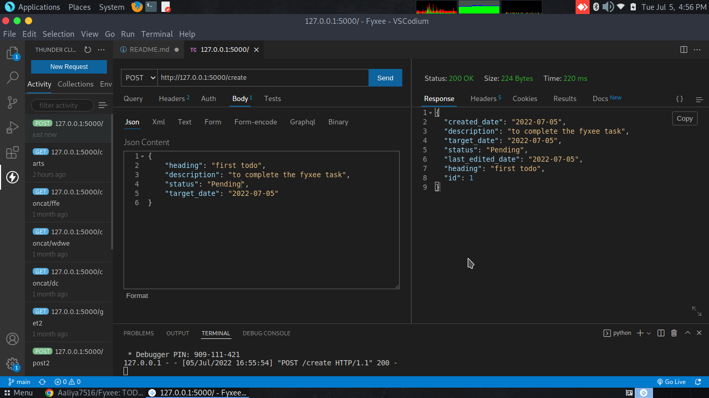
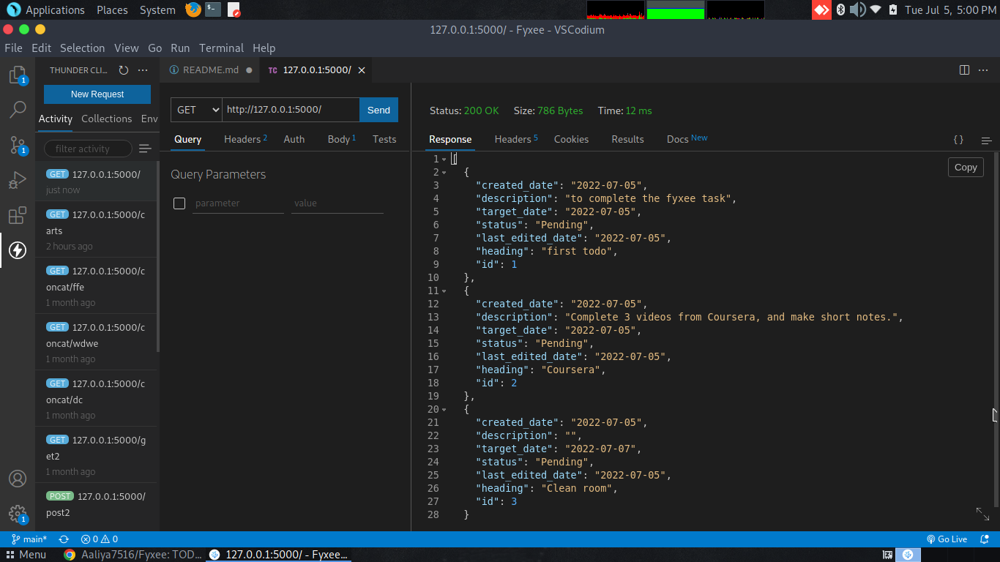
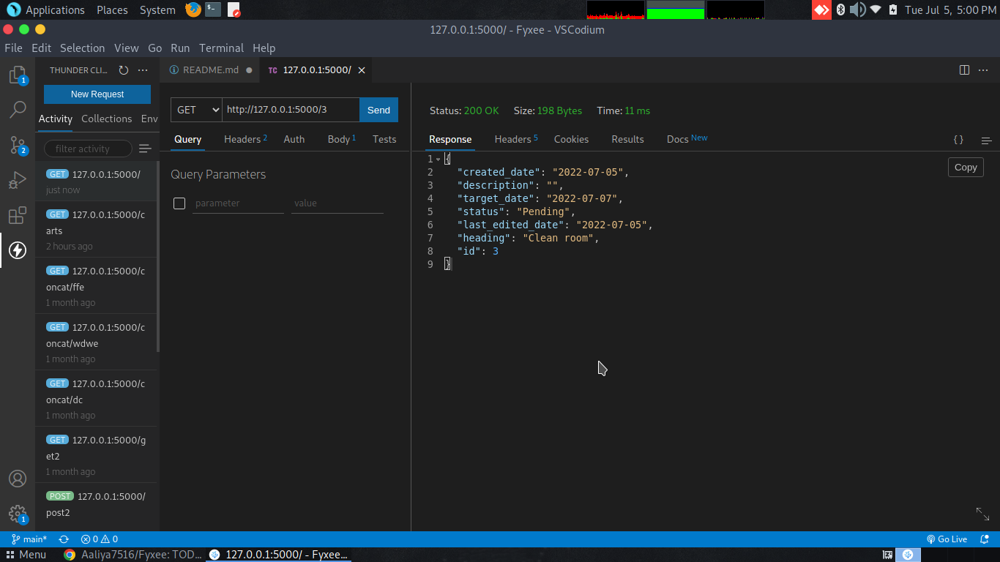
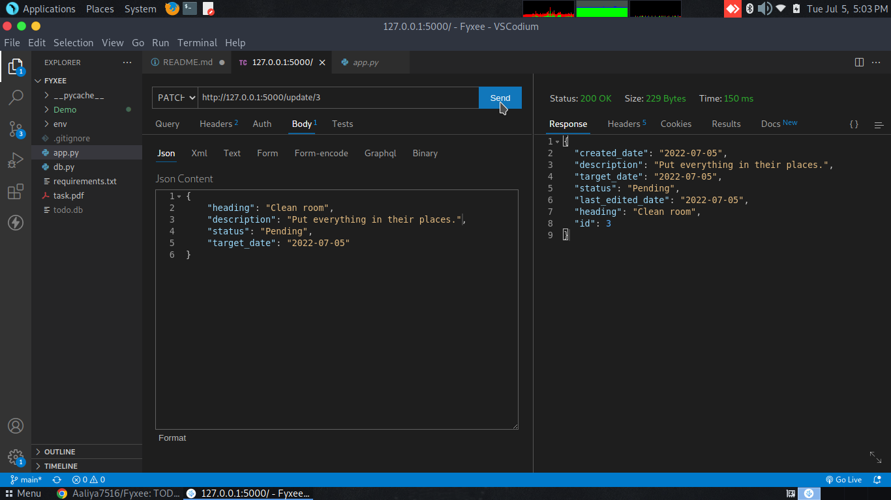
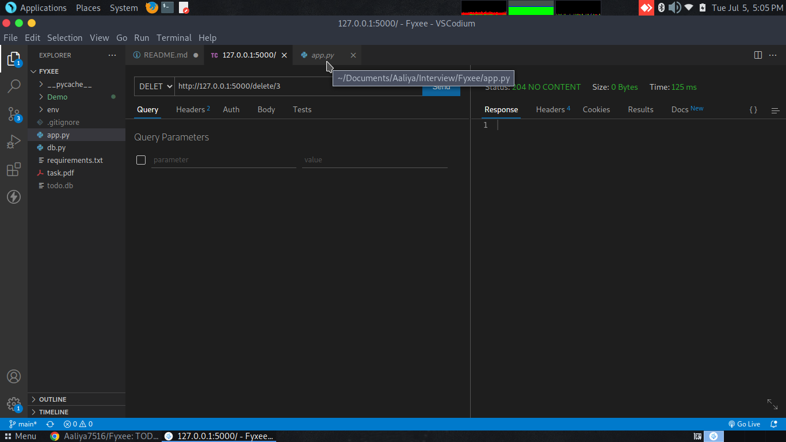
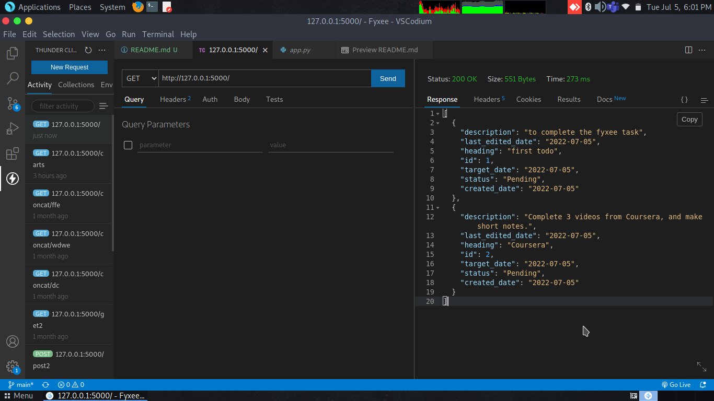

# TODO API

Backend of a TO-DO application created with the help of REST API performing CRUD operation - **Create, Read, Update and Delete** <br>
<br>

# Basic requirements

1. This project is built using Python 3.9.2
2. PIP is needed to install all the relevant packages.
3. (Optional but recommanded) Install virtual environment for Python using the following command: <br>
```pip install virtualenv```

# To Start The Server

1. Download the ZIP file of this repository or clone this repository in your system using the following command: <br> 
```git clone https://github.com/Aaliya7516/Fyxee.git``` <br>
2. Go to the repository by using the command: <br>
```cd Fyxee```
3. Now create virtual environment inside this repository: <br>
```virtualenv env```
4. Activate this virtual environment: <br>
```source env/bin/activate```
5. Install all the required libraries listed in 'requirements.txt' in this environment: <br>
```pip install -r requirements.txt```
6. Setup your SQLite Database using file 'db.py': <br>
```python db.py```
7. Finally, start your server using 'app.py' file: <br>
```python app.py```

Now, your server is ready!

# Endpoints

## Create a task

On sending *POST* request with json data in body section to the endpoint "create", the API will add this data to database. The below image demonstartes the same: <br>

 <br><br>

## Read all the tasks in todo

On sending *GET* request to the endpoint "/", the API will fetch all data from database and will dump them. The below image demonstartes the same: <br>

 <br><br>

## Read a task in todo by ID

On sending *GET* request to the endpoint "/<'id'>"where *id* is the id of the product, the API will fetch data from database that matches the Id of task and will dump it. The below image demonstartes the same: <br>

 <br><br>

## Update a task by ID

On sending *PATCH* request to the endpoint "update/<'id'>" where *id* is the id of the product, the API will update the data of product with that perticular id and will dump it as a response. The below image demonstartes the same: <br>

We can rectify this by 2nd image where the data with *"id:3"* has *description:""* and *target_date:"2022-07-07"*, but after correction, it has got some Description and  has changed to *target_date:"2022-07-05"*

 <br><br>

## Delete a task by ID

On sending *DELETE* request to the endpoint "delete/<'id'>" where *id* is the id of the product, the API will **DELETE** the data of product with that perticular id from the cart. The below image demonstartes the same: <br>

 <br><br>

List of tasks after Deletion of the product with given ID: <br> <br>

 <br><br>
